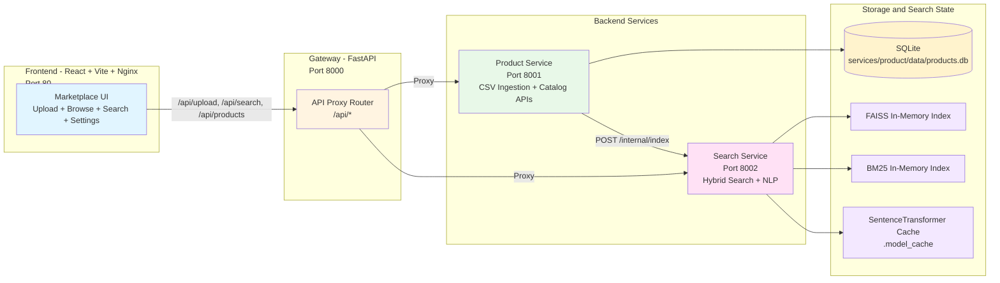

<p align="center">
  
</p>

# 🛒 SynapseMart - AI-Powered Hybrid Marketplace Search

Microservices-based marketplace platform for product ingestion, catalog management, and intelligent natural-language search.


---

## 📋 Table of Contents

- [Project Overview](#project-overview)
- [Architecture](#architecture)
- [Get Started](#get-started)
  - [Prerequisites](#prerequisites)
  - [Quick Start](#quick-start)
- [Project Structure](#project-structure)
- [Usage Guide](#usage-guide)
- [Environment Variables](#environment-variables)
- [Inference Benchmarks](#inference-benchmarks)
- [Model Capabilities](#model-capabilities)
- [Technology Stack](#technology-stack)
- [Troubleshooting](#troubleshooting)
- [License](#license)
- [Disclaimer](#disclaimer)

---

## Project Overview

**SynapseMart** is an end-to-end product discovery platform that combines structured catalog data with AI-enhanced search. It uses a gateway + microservices architecture where product ingestion and hybrid retrieval are separated into dedicated services.

### How It Works

1. **Upload and Cataloging**: Users upload product CSV files via the UI; the gateway forwards files to the Product Service for validation, deduplication, and SQLite persistence.
2. **LLM Enrichment**: When `LLM_ENRICHMENT_ENABLED=true`, the Product Service generates concise short descriptions and enriched search text through an OpenAI-compatible chat API before the final enriched index update.
3. **Index Building**: After product changes, the Product Service triggers the Search Service indexing endpoint to rebuild semantic and keyword indices.
4. **Natural Language Query Parsing**: Search queries are parsed for category, price bounds, and sort intent using spaCy + rule-based logic.
5. **Hybrid Retrieval and Ranking**: The Search Service combines FAISS semantic similarity with BM25 keyword matching, applies dynamic weighting, and returns ranked results through the gateway.

The codebase is implemented with FastAPI services, a React + Vite frontend, and Docker Compose orchestration. It supports background indexing, category-aware boosting, and filtered/sorted query responses.

---

## Architecture

SynapseMart separates catalog operations and search operations behind one gateway API consumed by the frontend.



### Architecture Components

**Frontend (React + Vite + Nginx)**
- Marketplace UI with pages for home, search, upload, and settings.
- Uses `ui/src/services/api.js` to call gateway endpoints (`/api/*`).
- In Docker, Nginx proxies `/api` traffic to the gateway container.

**Gateway (FastAPI)**
- Single entrypoint for frontend API calls (`/api/products`, `/api/search`, `/api/upload`, etc.).
- Proxies requests to Product and Search services using `httpx.AsyncClient`.
- Exposes gateway health endpoint at `/health`.

**Product Service**
- Handles CSV uploads and product deduplication.
- Stores products in SQLite and serves catalog/category/list APIs.
- Optionally enriches uploaded products with LLM-generated short descriptions and search text.
- Triggers async index rebuilds on the Search Service after catalog updates.

**Search Service**
- Parses user queries with spaCy and regex rules for filters/sort intent.
- Uses `SentenceTransformer(all-MiniLM-L6-v2)` + FAISS for semantic retrieval.
- Uses BM25 for lexical relevance and merges both via reciprocal-rank fusion.

### Data Ingestion Pipeline

1. UI uploads a CSV file through the gateway.
2. Product Service parses rows with Pandas, validates fields, removes duplicates, and stores the catalog in SQLite.
3. Product Service generates deterministic fallback `short_description` and `search_text` fields immediately.
4. If `LLM_ENRICHMENT_ENABLED=true`, Product Service runs background LLM enrichment to improve `short_description` quality and refresh `search_text`.
5. Product Service triggers Search Service indexing so FAISS and BM25 reflect the latest catalog data.

---

## Get Started

### Prerequisites

Before you begin, install:

- **Docker Engine** (24.x+)
- **Docker Compose Plugin** (v2+)
- Optional for local dev: **Python 3.10+** and **Node.js 18+**

#### Verify Installation

```bash
docker --version
docker compose version
docker info
```

### Quick Start

#### 1. Clone or Navigate to Repository

```bash
git clone <your-repo-url>
cd syanapseMart
```

#### 2. Create Your Environment File

```bash
cp .env.example .env
```

Edit `.env` with your preferred model endpoint. For OpenAI:

```dotenv
LLM_ENRICHMENT_ENABLED=true
LLM_ENRICHMENT_MODEL=gpt-4o-mini
LLM_ENRICHMENT_BASE_URL=https://api.openai.com/v1
LLM_ENRICHMENT_API_KEY=your_api_key
LLM_ENRICHMENT_BATCH_SIZE=8
LLM_ENRICHMENT_MAX_BATCH_CHARS=6000
BACKGROUND_ENRICHMENT_JOB_SIZE=4
```

For a local Ollama server with an OpenAI-compatible API:

```dotenv
LLM_ENRICHMENT_ENABLED=true
LLM_ENRICHMENT_MODEL=llama3.2
LLM_ENRICHMENT_BASE_URL=http://host.docker.internal:11434/v1
LLM_ENRICHMENT_API_KEY=ollama
LLM_ENRICHMENT_BATCH_SIZE=4
LLM_ENRICHMENT_MAX_BATCH_CHARS=3000
BACKGROUND_ENRICHMENT_JOB_SIZE=4
QUERY_PARSER_LLM_ENABLED=true
QUERY_PARSER_LLM_MODEL=llama3.2
QUERY_PARSER_LLM_BASE_URL=http://host.docker.internal:11434/v1
QUERY_PARSER_LLM_API_KEY=ollama
```

#### 3. Launch the Full Stack

```bash
docker compose up --build -d
```

For live logs:

```bash
docker compose up --build
```

#### 4. Access the Application

- **Frontend UI**: http://localhost:80
- **Gateway API**: http://localhost:8000
- **Product Service Docs**: http://localhost:8001/docs
- **Search Service Docs**: http://localhost:8002/docs

#### 5. Verify Services

```bash
# Gateway health
curl http://localhost:8000/health

# Basic gateway-backed checks
curl http://localhost:8000/api/products
curl "http://localhost:8000/api/search?q=laptop"

# Container status
docker compose ps
```

#### 6. Stop the Application

```bash
docker compose down
docker compose down -v
```

---

## Project Structure

```text
syanapseMart/
├── gateway/
│   ├── app/
│   │   ├── api/proxy.py               # Gateway proxy endpoints
│   │   ├── core/config.py             # Product/Search service URLs
│   │   └── main.py                    # FastAPI gateway entrypoint (8000)
│   ├── requirements.txt
│   └── Dockerfile
├── services/
│   ├── product/
│   │   ├── app/
│   │   │   ├── api/routes.py          # /products upload/list/categories/delete
│   │   │   ├── core/database.py       # SQLite engine/session
│   │   │   ├── models/product.py      # Product schema
│   │   │   ├── services/catalog.py    # CSV ingestion + search reindex trigger
│   │   │   └── main.py                # Product service entrypoint (8001)
│   │   ├── data/                      # SQLite DB and uploaded CSV files
│   │   ├── requirements.txt
│   │   └── Dockerfile
│   └── search/
│       ├── app/
│       │   ├── api/routes.py          # /search and /index endpoints
│       │   ├── services/nlp_parser.py # Query parsing and category matching
│       │   ├── services/search_engine.py # FAISS + BM25 hybrid engine
│       │   └── main.py                # Search service entrypoint (8002)
│       ├── requirements.txt
│       └── Dockerfile
├── ui/
│   ├── src/
│   │   ├── pages/                     # Home, Search, Upload, Settings
│   │   ├── components/                # Product cards/lists/upload widgets
│   │   ├── services/api.js            # Frontend API client
│   │   └── main.jsx
│   ├── nginx.conf                     # /api proxy to gateway
│   ├── package.json
│   └── Dockerfile
├── scripts/                           # Seed, upload, cleanup utilities
├── tests/                             # Integration and search tests
├── data/                              # Sample/upload data
├── logs/                              # Runtime logs
├── .model_cache/                      # SentenceTransformer cache volume
├── docker-compose.yml
└── README.md
```

---

## Usage Guide

### Using SynapseMart

1. **Upload Products**
- Open `http://localhost/upload`.
- Upload a CSV file with product fields (name, description, category, price, etc.).
- Product Service ingests rows, skips duplicates, and triggers reindexing.

2. **Browse Catalog**
- Open `http://localhost/search` or use listing routes through the UI.
- Filter products by category from available catalog categories.

3. **Search in Natural Language**
- Enter queries like `laptops under 1000` or `cheap gaming mouse`.
- Search Service extracts filters/sort hints and executes hybrid retrieval.

4. **Manage Catalog**
- From settings, clear the catalog when needed.
- Clearing products also triggers search index refresh to keep results consistent.

### API Endpoint Matrix

| Service | Endpoint | Method | Purpose |
|---------|----------|--------|---------|
| Gateway (`:8000`) | `/health` | `GET` | Gateway health check |
| Gateway (`:8000`) | `/api/products` | `GET` | List products (with query params passthrough) |
| Gateway (`:8000`) | `/api/categories` | `GET` | List unique categories |
| Gateway (`:8000`) | `/api/upload` | `POST` | Upload product CSV |
| Gateway (`:8000`) | `/api/search` | `GET` | Execute search query |
| Gateway (`:8000`) | `/api/products/clear` | `DELETE` | Delete all products |
| Product (`:8001`) | `/products/upload` | `POST` | Ingest CSV into DB |
| Product (`:8001`) | `/products/` | `GET` | List products |
| Product (`:8001`) | `/products/categories` | `GET` | Return categories |
| Product (`:8001`) | `/products/` | `DELETE` | Wipe product catalog |
| Search (`:8002`) | `/search` | `GET` | Hybrid search endpoint |
| Search (`:8002`) | `/internal/index` | `POST` | Rebuild search index from product list |

---

## Environment Variables

Create a root `.env` from `.env.example` and keep service configuration there.

| Variable | Service | Description | Default |
|----------|---------|-------------|---------|
| `PRODUCT_SERVICE_URL` | Gateway | Internal URL used by gateway for product calls | `http://product-service:8001` |
| `SEARCH_SERVICE_URL` | Gateway | Internal URL used by gateway for search calls | `http://search-service:8002` |
| `SEARCH_SERVICE_URL` | Product | URL used by product service to trigger indexing | `http://search-service:8002` |
| `PRODUCT_SERVICE_URL` | Search | URL used by search service for lazy category loading | `http://product-service:8001` |
| `LLM_ENRICHMENT_ENABLED` | Product | Enables upload-time LLM enrichment | `false` |
| `LLM_ENRICHMENT_MODEL` | Product | OpenAI-compatible chat model name | `gpt-4o-mini` |
| `LLM_ENRICHMENT_BASE_URL` | Product | Base URL for OpenAI-compatible `/v1` endpoint | `https://api.openai.com/v1` |
| `LLM_ENRICHMENT_API_KEY` | Product | API key or local placeholder token | empty |
| `LLM_ENRICHMENT_TIMEOUT` | Product | Timeout for enrichment calls in seconds | `20` |
| `LLM_ENRICHMENT_BATCH_SIZE` | Product | Max products per LLM enrichment request | `8` |
| `LLM_ENRICHMENT_MAX_BATCH_CHARS` | Product | Max serialized payload size per enrichment request | `6000` |
| `BACKGROUND_ENRICHMENT_JOB_SIZE` | Product | Number of products processed per background job batch | `4` |
| `QUERY_PARSER_LLM_ENABLED` | Search | Enables LLM-based natural language query parsing | `false` |
| `QUERY_PARSER_LLM_MODEL` | Search | OpenAI-compatible query parser model | `gpt-4o-mini` |
| `QUERY_PARSER_LLM_BASE_URL` | Search | Base URL for the parser model endpoint | empty |
| `QUERY_PARSER_LLM_API_KEY` | Search | API key or local placeholder token | empty |
| `QUERY_PARSER_LLM_TIMEOUT` | Search | Timeout for query parser calls in seconds | `15` |
| `SENTENCE_TRANSFORMERS_HOME` | Search | Cache directory for transformer model files | `/app/model_cache` |
| `VITE_API_URL` | UI (dev) | Frontend API base URL during local `vite` runs | `http://localhost:8000` |

**Note**:
- In Docker, `docker-compose.yml` mounts `./.model_cache` to `/app/model_cache` for the Search Service.
- If this cache contains incomplete model files, search startup can fail during model JSON loading.

---

## Inference Benchmarks

The table below summarizes the current SynapseMart inference profile for the cloud LLM path used by product enrichment and query parsing, paired with the local embedding model used for hybrid search.

| Provider | LLM Model | LLM Context | Embedding Model | Embed Context | Deployment | Avg Input Tokens/Gen | Avg Output Tokens/Gen | Avg Total Tokens/Gen | P50 Latency (ms) | P95 Latency (ms) | Throughput (req/s) | Hardware |
| -------- | --------- | ----------- | --------------- | ------------- | ---------- | -------------------- | --------------------- | -------------------- | ---------------- | ---------------- | ------------------ | -------- |
| OpenAI (Cloud) | `gpt-4o-mini` | 128k | `all-MiniLM-L6-v2` | 256 | API (Cloud) | 174 | 72 | 246 | 2,302 | 4,512 | 0.148 | Cloud GPUs |

> **Notes:**
>
> - These token measurements are per product generation for `short_description` and `search_text`, plus query-parser generations used for intent parsing.
> - `gpt-4o-mini` is used for two optional LLM paths in SynapseMart: upload-time enrichment and query parsing.
> - `all-MiniLM-L6-v2` is the local sentence-transformer model used to create semantic embeddings for hybrid search retrieval.
> - The query parser helps improve intent parsing on top of the built-in NLP pipeline, so searches can better infer category, price bounds, and operator intent.
> - Langfuse tracing can be enabled to observe both enrichment and query-parser calls during benchmark runs.

---

## Model Capabilities

### GPT-4o-mini

OpenAI's compact cloud model used in SynapseMart for optional product enrichment and optional query parsing.

| Attribute | Details |
| --------- | ------- |
| **Role in SynapseMart** | Generates `short_description`, `search_text`, and structured query-parser output |
| **Deployment** | Cloud API |
| **Context Window** | 128,000 tokens |
| **Structured Output** | Supported |
| **Use in Project** | `LLM_ENRICHMENT_*` and `QUERY_PARSER_LLM_*` config paths |

### all-MiniLM-L6-v2

Sentence-transformers embedding model used by the search service for semantic retrieval.

| Attribute | Details |
| --------- | ------- |
| **Role in SynapseMart** | Creates product and query embeddings for FAISS search |
| **Architecture** | MiniLM sentence-transformer |
| **Embedding Dimensions** | 384 |
| **Max Sequence Length** | 256 tokens |
| **Deployment** | Local inside `search-service` |
| **Use in Project** | `SentenceTransformer('all-MiniLM-L6-v2')` in the hybrid search engine |

### Query Parser Path

SynapseMart has two query-understanding layers:

- Rule-based NLP with `spaCy` (`en_core_web_sm`) for local parsing and fallback behavior.
- Optional LLM query parser with `gpt-4o-mini` to improve intent parsing, category selection, and numeric filter extraction.

---

## Technology Stack

### Backend
- **Framework**: FastAPI + Uvicorn
- **Gateway HTTP Client**: `httpx`
- **Database**: SQLite + SQLAlchemy ORM
- **Data Ingestion**: `pandas`, `python-multipart`
- **Search/NLP**:
  - `sentence-transformers` (`all-MiniLM-L6-v2`)
  - `faiss-cpu`
  - `rank-bm25`
  - `spaCy` (`en_core_web_sm`)
  - `yake`

### Frontend
- **Framework**: React 18 + Vite
- **Runtime in Docker**: Nginx
- **API Integration**: Fetch-based client in `ui/src/services/api.js`

### Orchestration
- **Containerization**: Docker
- **Service Orchestration**: Docker Compose

---

## Troubleshooting

### Common Issues

**Issue**: Search service fails with `JSONDecodeError: Expecting value: line 1 column 1 (char 0)`
- Cause: corrupted or empty files under `.model_cache` for `all-MiniLM-L6-v2`.
- Fix:
```bash
rm -rf .model_cache/models--sentence-transformers--all-MiniLM-L6-v2
docker compose up --build
```

**Issue**: Upload succeeds but search returns empty results
- Confirm indexing was triggered from Product Service logs.
- Verify Search Service is running and received `/internal/index`.
- Re-upload or clear + re-upload to force index rebuild.

**Issue**: Gateway returns `503 Product service unavailable` or `503 Search service unavailable`
- Check container health and network:
```bash
docker compose ps
docker compose logs --tail=200 gateway product-service search-service
```

**Issue**: Frontend cannot reach API in local development (`npm run dev`)
- Set `VITE_API_URL=http://localhost:8000` in shell or `.env`.
- Ensure gateway is running on port `8000`.

### Debug Mode

```bash
# Foreground logs
docker compose up --build

# Tail specific services
docker compose logs -f gateway product-service search-service ui
```

---

## License

This project is licensed under our [LICENSE](./LICENSE.md) file for details.

---

## Disclaimer

**SynapseMart** is provided as-is for educational and proof-of-concept use.

- Search ranking quality depends on uploaded data quality and query phrasing.
- NLP interpretation of price/category/sort intent may not be perfect for every query.
- Validate outputs before using this system in production workflows.

For full disclaimer details, see [DISCLAIMER.md](./DISCLAIMER.md)
