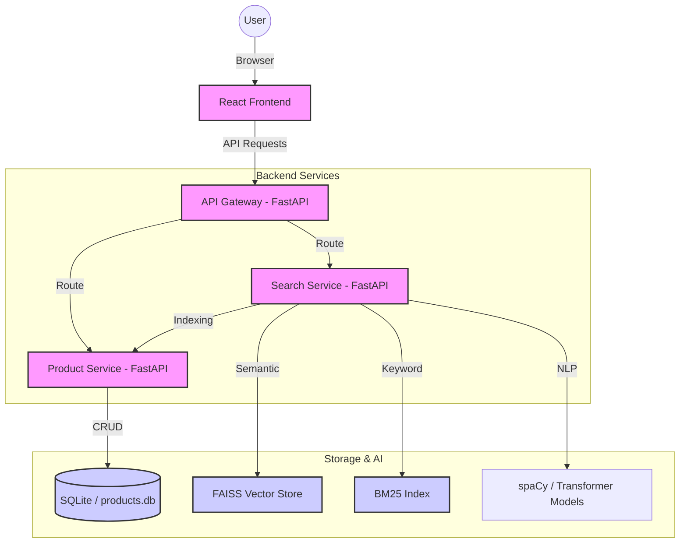

# SynapseMart 🛒


**Enterprise-Ready Microservices Marketplace** with Smart AI Search.

SynapseMart is a containerized microservice application for managing product catalogs. It features a hybrid AI search engine combining semantic vectors and keyword indexing to deliver intelligent, natural language search results.

---

## 🏗️ Technical Architecture

SynapseMart follows a modular microservices architecture designed for scalability and isolation of concerns.



---

## 🚀 Deployment Options

### Option 1: Quick Start (Docker) - Recommended

Ensure you have **Docker** and **Docker Compose** installed.

```bash
# Build and start the entire stack
docker-compose up --build
```

#### Service Endpoints
| Service | URL | Description |
| :--- | :--- | :--- |
| **Frontend (UI)** | [http://localhost](http://localhost) | Production React App (Nginx) |
| **API Gateway** | [http://localhost:8000](http://localhost:8000) | Central routing & entry point |
| **Product Service** | [http://localhost:8001/docs](http://localhost:8001/docs) | Catalog management |
| **Search Service** | [http://localhost:8002/docs](http://localhost:8002/docs) | AI Search & NLP Engine |

---

### Option 2: Running Locally (Manual Setup)

This is useful for local development and debugging without container overhead.

#### 1. Prerequisites
- Python 3.10+
- Node.js 18+ & npm/pnpm
- macOS/Linux/WSL recommended (standard `venv` usage below)

#### 2. Backend Setup (Services & Gateway)
Open three terminals (or use a multiplexer) for the backend components:

**Terminal 1: Product Service**
```bash
cd services/product
python -m venv venv
source venv/bin/activate  # Windows: venv\Scripts\activate
pip install -r requirements.txt
python -m app.main
```

**Terminal 2: Search Service**
```bash
cd services/search
python -m venv venv
source venv/bin/activate  # Windows: venv\Scripts\activate
pip install -r requirements.txt
# Ensure models are cached in a local dir
export SENTENCE_TRANSFORMERS_HOME=./.model_cache
python -m app.main
```

**Terminal 3: API Gateway**
```bash
cd gateway
python -m venv venv
source venv/bin/activate  # Windows: venv\Scripts\activate
pip install -r requirements.txt
# Set service URLs to local ports
export PRODUCT_SERVICE_URL=http://localhost:8001
export SEARCH_SERVICE_URL=http://localhost:8002
python -m app.main
```

#### 3. Frontend Setup
**Terminal 4: UI**
```bash
cd ui
npm install
npm run dev
```

---

## ✨ Features

- **🦾 AI-Powered Search**:
    - **Hybrid Retrieval**: Combines `FAISS` semantic vectors with `rank-bm25` keyword matching.
    - **Smart Query Routing**: Dynamically weights search signals based on query complexity.
    - **NLP Parsing**: Automatically extracts price ranges, categories, and sorting intent.
- **📦 Containerized Architecture**:
    - Multi-stage Docker builds for minimal image size.
    - Orchestrated with Docker Compose.
- **🛡️ Production Readiness**:
    - Standardized Python `logging`.
    - Comprehensive API documentation via FastAPI Swagger UI.

---

## 📊 Monitoring & Logs

SynapseMart utilizes standard Python `logging` for traceability.

### 1. Docker Logs
Monitor real-time logs for all services:
```bash
docker-compose logs -f
```

### 2. Persistent Logs
When running via Docker, logs are persisted in the [logs/](logs/) directory on the host machine.
- `gateway.log`: API routing and proxy events.
- `product.log`: Database operations and product management.
- `search.log`: AI inference and hybrid search processing.

---

## 📂 Project Structure

```text
synapseMart/
├── gateway/            # Central entry point (FastAPI)
├── services/
│   ├── product/       # CRUD logic & SQLite database
│   └── search/        # AI Search, NLP, & Faiss index
├── ui/                 # React Frontend (Vite)
├── scripts/            # Utility scripts (Bulk Upload, DB Seed)
├── data/               # Persistent database storage
└── docker-compose.yml  # Microservice orchestration
```

---

## 🤝 Contributing & License

Contributions are welcome! Please read our [Contributing Guide](CONTRIBUTING.md) and [Code of Conduct](CODE_OF_CONDUCT.md) before submitting a Pull Request.

Built with ❤️ by the SynapseMart community. This project is licensed under the [MIT License](LICENSE).

---

## ⚠️ Disclaimer

**This project is for educational and proof-of-concept purposes only.** SynapseMart is provided "as is" without warranty of any kind. Users should conduct their own security audits before deploying any part of this code to a production environment. The authors are not responsible for any data loss or security vulnerabilities incurred through the use of this software.
